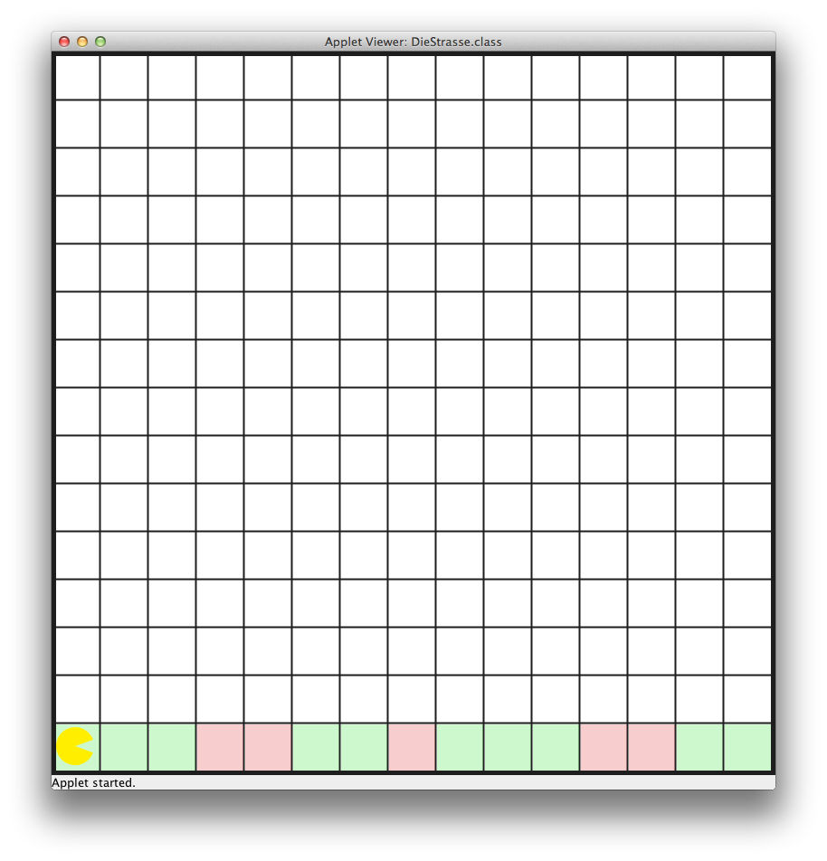
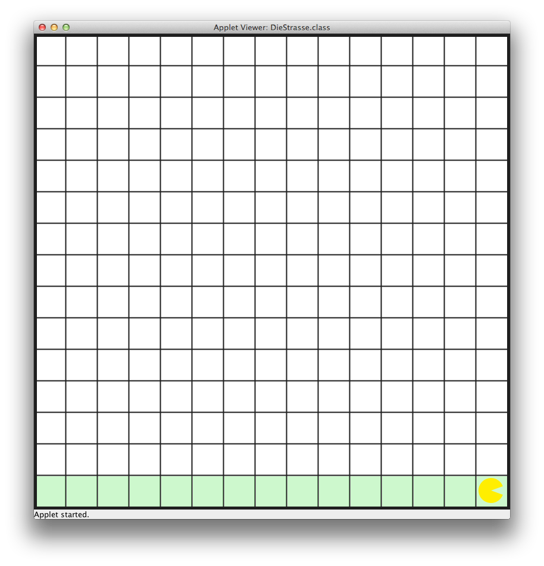

# U01-2 | Bouncer repariert eine Straße

## Ausgangslange
Bouncer steht auf einer grünen Straße mit einigen Schlaglöchern (rot). Bouncers Aufgabe ist es die komplette Straße zu überprüfen und alle zerstörten Stellen auszubessern. Am Ende sollen alle Felder der Straße grün eingefärbt sein:  

| Bouncer steht auf dem ersten Feld der kaputten Straße. | Bouncer steht auf dem letzten Feld der reparierten Straße |
|:------:|:------:|
|  |  |


Die Ausgangsbedingung für diese Aufgabe ist wie folgt: Bouncer steht am unteren Kartenrand auf dem ersten Feld (0, 14) der Straße und schaut nach Osten. Die Straße führt bis zur gegenüberliegenden Wand und beeinhaltet verschiedene Schlaglöcher.  

## Aufgabe
Lösen Sie folgende Teilaufgaben, um die Straße zu reparieren:  

1. Bouncer muss die komplette Straße überprüfen, d.h. er muss bis zur gegenüberliegenden Wand laufen
2. Auf jedem Feld muss er überprüfen, ob dieses intakt *grün* bzw. defekt (rot) ist
3. Kaputte Felder werden repariert, in dem sie grün eingefärbt werden: `FieldColor.GREEN`  

*Benutzen Sie die Karte **Street** um die korrekte Welt zu laden*. Beachten Sie, dass Sie das letzte Feld möglicherweis gesondert betrachten müssen. Die Farbe eines Feldes können Sie mit dem Befehl `isOnFieldWithColor()` erfragen. In den runden Klammern fügen Sie die Farbe ein, die sie überprüfen wollen. Entweder `FieldColor. RED` , `FieldColor.GREEN` oder `FieldColor. BLUE` .  

**Beispiel:** Verwenden Sie eine `if` -Abfrage, um Informationen über Bouncers Umgebung zu erhalten. Wenn Sie wissen möchten, ob das Feld vor Bouncer frei ist, können Sie folgende Konstruktion verwenden: 

```
if(bouncer.canMoveForward()) {
    // Die Befehle zwischen diesen Klammern werden nur dann ausgefuehrt, wenn das Feld vor Bouncer frei ist. 
} 
```  

**Beispiel:** Verwenden die `while`-Anweisung um Bouncer Dinge so lange tun zu lassen, bis eine bestimmte Situation eintritt. Um Bouncer so lange in die aktuelle Blickrichtung laufen zu lassen, bis er an den Kartenrand oder ein blockiertes Feld stößt, können Sie diese Konstruktion verwenden:  

```
while(bouncer.canMoveForward()) {     
    move();
} 
```  
